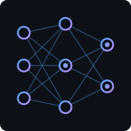

  

---

<h1 align="center">Hello World 👋 I'm Hlulani</h1>

---

## 🔗 Know About Me

<table>
  <tr>
    <td width="240" align="center"></td>
    <td>
      <b>Hey there! I'm Hlulani Jabulani Mathebula</b>  
      I'm an <b>AI Engineer</b> based in Cape Town, South Africa, building intelligent systems from LLM-powered applications and RAG pipelines to autonomous agents and production ML services.  
      I care about AI that is reliable, measurable and useful in the real world, not just impressive in a demo.  
      🔭 Currently exploring multi-agent systems, evaluation and model optimisation.  
      ⚙️ <b>Tech Stack:</b> 
      
      
      
      
      
      
    </td>
  </tr>
</table>

## 🔗 What I Do

| 🤖 Generative AI | 🧪 Machine Learning | ☁️ AI Engineering & MLOps |
|---|---|---|
| LLM-powered apps | Training & evaluating models | Models as APIs |
| RAG with vector databases | Feature engineering & pipelines | Docker & CI/CD for ML |
| Autonomous agents & tool use | Deep learning with PyTorch | Monitoring & experiment tracking |

## 🔗 Top Projects

<table>
  <tr>
    <td>
      <ul>
        <li><b><a href="https://github.com/hlulanij/HlulaniMathebula_Portfolio">PORTFOLIO</a></b> My personal portfolio site.</li>
         
        <li><b>AI PROJECTS</b> LLM, RAG and agent projects are on the way. Check back soon.</li>
      </ul>
    </td>
    <td width="150" align="center"></td>
  </tr>
</table>

## 🔗 Connect

  
  

> Models are never finished. They only get slightly less wrong over time.
>
> Every experiment I run is a small step toward AI that people can actually trust.

## 🔗 Contribution

  

  
  

