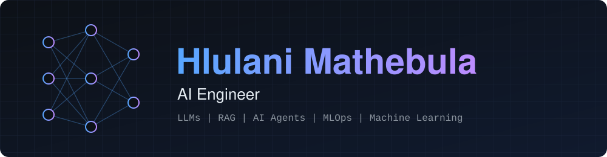
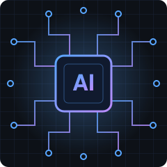

  

  
  

---

## About

<table>
  <tr>
    <td width="240" align="center"></td>
    <td>
      AI Engineer in Cape Town, building AI agents, knowledge-retrieval systems and automated data pipelines on Azure and Microsoft 365.  
      I take manual business processes and turn them into governed, automated workflows: grounded in approved data, auditable end to end, and safe to put in front of users.  
      <b>Experience highlights</b>
      <ul>
        <li>Built grounded AI agents with guardrails on Microsoft Foundry and Copilot Studio</li>
        <li>Designed an Azure AI architecture for transcript search, PII detection and redaction</li>
        <li>Replaced a manual performance-scoring process with scheduled pipelines and a live dashboard</li>
        <li>Automated approvals, notifications and form workflows across Microsoft 365</li>
      </ul>
    </td>
  </tr>
</table>

## What I Do

| 🤖 AI Agents & LLMs | 🔗 Data & Integration | ⚙️ Automation |
|---|---|---|
| Agent instructions and guardrails | Scheduled pipelines from business systems | Approval and notification workflows |
| Knowledge retrieval and grounded answers | SQL scoring and reporting layers | Digitised forms and processes |
| Prompt engineering and evaluation | REST API and CRM integration | Event-driven flows across Microsoft 365 |

## Tech Stack

**AI & Agents** 

**Cloud & Microsoft 365** 

**Automation** 

**Data & Integration** 

**Languages & Tools** 

## How I Build

- **Grounded by default.** Agents answer only from approved knowledge, cite it, and decline when the evidence is missing.
- **Privacy by design.** Personal data is redacted before indexing, so nothing downstream can leak it.
- **Rules as data.** Thresholds and scoring weights live in configuration, so changes need no redeployment.
- **Least privilege.** Dashboards read published views through read-only accounts and never see raw records.
- **Verified.** Every prototype ships with tests, including independent recomputation of results.

## Selected Work

### Automated Performance-Scoring Platform
Replaced a manual, screenshot-based fortnightly leaderboard with a warehouse-driven scoring system and a live dashboard.

**Links:** [Case study (PDF)](docs/Automated_Performance_Scoring_Platform_Case_Study.pdf) · [Prototype](https://github.com/hlulanij/scoring-pipeline)

- Scheduled ingestion from a project-management platform and a CRM into BigQuery, refreshed twice daily
- Configuration-driven SQL scoring layer of 17 views, with self-rolling cycles and time-zone-correct reporting
- Least-privilege access through a read-only service account and authorised views
- Freshness monitoring, unscored-record reports and independent recomputation; totals reconciled 100% at launch

`SQL` `BigQuery` `Python` `PowerShell` `REST APIs`

### Transcript Intelligence Platform
Azure AI architecture for transcript processing, knowledge retrieval, and PII detection and redaction.

**Links:** [Prototype](https://github.com/hlulanij/transcript-intelligence)

- Combines Azure Storage, Azure AI Search, Azure OpenAI and Azure AI Language
- Redacts personal data before indexing and refuses questions about what individuals said
- Agent guardrails keep answers grounded in approved knowledge and block raw transcripts

`Azure OpenAI` `Azure AI Search` `Azure AI Language` `Microsoft Foundry`

### Grounded Business Agents
Copilot Studio agents that answer routine business queries and trigger automated actions.

**Links:** [Prototype](https://github.com/hlulanij/grounded-agent)

- Retrieval from an Azure AI Search index of approved knowledge, with responses validated against it
- Power Automate flows for submissions, approvals and notifications, joined to Power Apps, SharePoint and Forms

`Copilot Studio` `Power Automate` `Power Apps` `SharePoint`

### Weekly Pipeline Check
Automated Monday sales-pipeline email for portfolio directors, with an agent that answers questions from the same snapshot.

**Links:** [Prototype](https://github.com/hlulanij/pipeline-check)

- Calculates outlook, status and red flags once, so the email and the agent always agree
- Sends only for portfolios that have data and alerts the owner on an empty week
- Agent answers only from the latest snapshot, states the week, and replies "Not in the data." otherwise

`Copilot Studio` `Power Automate` `SharePoint` `Python`

## Connect

Open to AI engineering roles and collaboration. Reach me on [LinkedIn](https://www.linkedin.com/in/hlulanimathebula).
